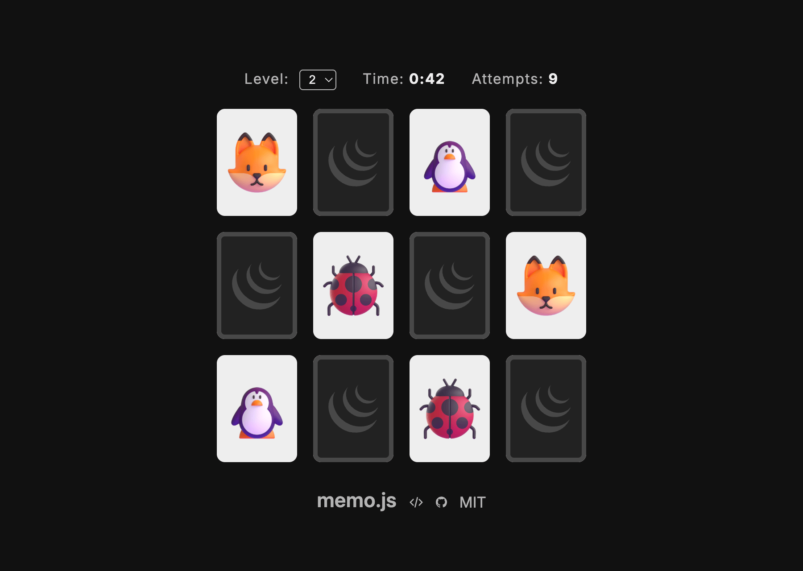

# memo.js: Classic Board Game with jQuery

In 2013, colleagues agreed a game was hard to build, with few specialized libraries and a lot to
wire up by hand. I disagreed. You could build one with almost anything, even something as far from
games as jQuery. They called it impossible. So I built it.

- **jQuery** is enough to get simple board games with few code lines.
- **Memorize** is one of the simplest games of this genre.
- Combine them and obtain your first **JavaScript** game in few minutes.

[Play the demo](https://javier.beaumont.eus/memo.js/) · [See how it's built](https://javier.beaumont.eus/memo.js/slides/)

## Play

Flip two cards to find a matching pair. Matched pairs stay face up; a miss flips
both back. Clear the board in as few attempts and as little time as you can.

- **Levels** (1 to 12): more pairs each level. Set one with `?level=N` or pick it
  from the selector; otherwise a random level loads.
- **Live stats**: the timer starts on your first flip, and every turn counts.
- **Win screen**: your time and attempts, with **Replay** and **Next**.
- **Responsive**: the board reflows to the most square grid for the viewport.

## How it's built

The game is a short jQuery script (`script/memo.js`) that builds the board,
deals and shuffles the cards, and runs the flip, compare and resolve turn. The
[slides](https://javier.beaumont.eus/memo.js/slides/) walk through it step by
step: the board, the playing cards, printing the elements into the DOM, and the
player interaction.

## Run it locally

No build, no dependencies, just static files. Clone it and open `index.html`.

The game is at the root; the slides live under `slides/`.

## Credits

- **[jQuery](https://jquery.com/)** ([MIT License](https://jquery.org/license/))
- **[CodeMirror 5](https://codemirror.net/5/)** ([MIT License](https://codemirror.net/5/LICENSE))
- **[Fluent UI Emoji](https://github.com/microsoft/fluentui-emoji)** ([MIT License](https://github.com/microsoft/fluentui-emoji/blob/main/LICENSE))
- **[Radix Colors](https://github.com/radix-ui/colors)** ([MIT License](https://github.com/radix-ui/colors/blob/main/LICENSE))
- **[Inter](https://rsms.me/inter/)** ([SIL OFL 1.1](https://github.com/rsms/inter/blob/master/LICENSE.txt))

## License

- **Code** (the game's and the slides' scripts, HTML and CSS): [MIT](LICENSE).
- **Slides** (content and figures): [CC-BY-SA 4.0](https://creativecommons.org/licenses/by-sa/4.0/).
